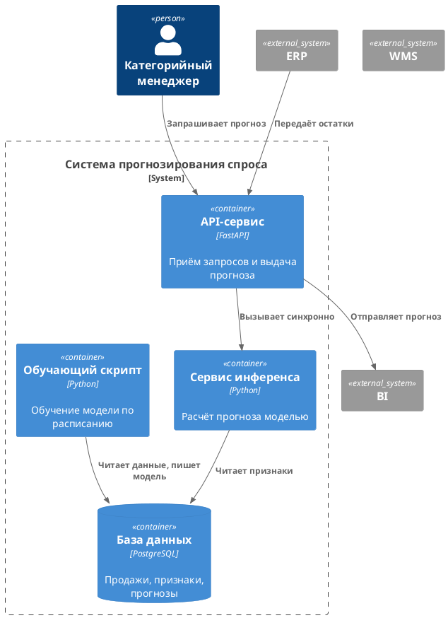

# Архитектурное описание системы прогнозирования спроса

Материал для инспекции (КИМ-3.4, часть В). Подготовлен средствами генеративного искусственного интеллекта и намеренно содержит дефекты. Дефекты не помечены; их выявление, классификация и связь с нарушенными требованиями являются заданием.

## 1. Контекст

Система прогнозирования спроса взаимодействует с ERP, WMS и BI. Категорийный менеджер получает рекомендации по пополнению.

## 2. Контейнеры

## 3. Описание компонентов

- **API-сервис** принимает запрос менеджера и синхронно вызывает сервис инференса, возвращая результат в том же запросе.
- **Сервис инференса** загружает модель из базы данных и рассчитывает прогноз.
- **Обучающий скрипт** запускается по расписанию, читает данные из базы и сохраняет обученную модель в ту же базу, перезаписывая предыдущую.
- **База данных** хранит продажи, признаки, обученную модель и прогнозы.

## 4. Развёртывание

Все контейнеры развёртываются на одном сервере приложений. Модель хранится в таблице базы данных в виде сериализованного объекта.

## 5. Обработка потока

Менеджер запрашивает прогноз, API синхронно обращается к сервису инференса, тот читает признаки и возвращает результат. Обучение выполняется еженедельно и заменяет действующую модель.
